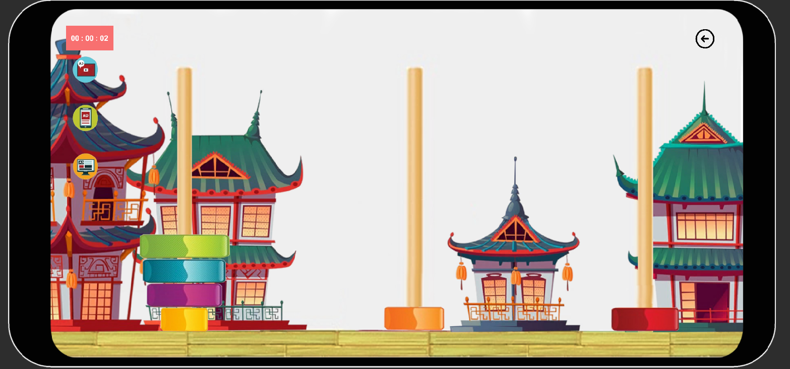

# DragAndDropGames
DragAndDropGames — Android Version

Unity 2D Drag & Drop mini-games designed exclusively for Android devices.

This branch contains the Android build version of the project, including mobile-optimized controls, UI scaling, ads, and touch-based gameplay.

📱 Game 1 — City Car Puzzle (Android)

A colorful mini-game where the player drags different cars onto their matching shadows on the city map.

Features

🎮 Full touch-based drag & drop
🚗 Multiple cars with unique shadow shapes
✈️ Moving flying obstacles
💣 Bomb objects with explosion animation
🔊 Sound effects for click, drop, win, lose
⏱️ Timer (HH:MM:SS)
⭐ Win and defeat screens
📸 Camera zoom & movement limits
🎬 Animated main menu with 3 buttons
💰 Integrated ads:
- Interstitial ads
- Rewarded ads
- Banner ads

🧱 Game 2 — Hanoj Tower (Android)

A physics-based adaptation of the classic Tower of Hanoi puzzle.

Features

🧩 Random spawning of 6 blocks across 3 towers
📱 Fully touch-controlled drag & drop
⚙️ Physics-based falling and stacking
📏 Auto-alignment when blocks land on towers
🔊 Sound effects for click, drop, and victory
⛔ Lose screen when any block falls out of bounds
⭐ Three different win panels based on time:
↔️ Forced landscape orientation
📺 Banner ads displayed at the top of the screen
🎵 Separate background music + win sound
🎮 Logic-based tower validation (block sizes, stack order)

🛠️ To-Do Progress

Development checklist:
- [x] Create the necessary folders 
- [x] Add necessary assets 
- [x] Add cars on the map
- [x] Create C# script for drag and drop
- [x] Create C# script for transformation
- [x] Create C# script for object fixation
- [x] Add necessary sounds and audio sources
- [x] Create logic for winning
- [x] Create camera script for zoom-in/out and camera restrictions
- [x] Create animated main menu with 3 buttons, sound, animated objects 
- [x] Create C# script for scene change and quit option
- [x] Create game timer (HH:MM:SS)
- [x] Add flying obstacle in a city scene
- [x] Change target platform to Android
- [x] Replace all mouse input with touch
- [x] Fix camera max zoom
- [x] Add interstitial ad
- [x] Add rewarded ad
- [x] Add banner ad
- [x] Create a third branch and scene
- [x] Create game physics
- [x] Spawn 6 blocks in random for 3 towers
- [x] Create game logic for winning and loses
- [x] Add ads

Created by Artjoms